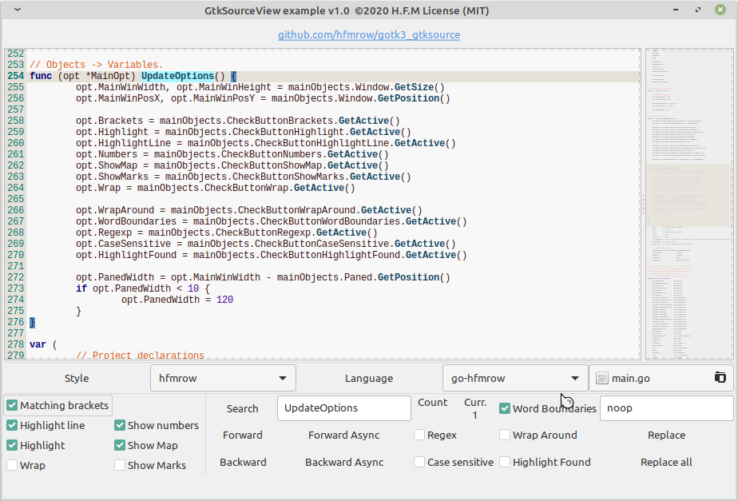

# gotk3 SourceView usage:

##### GtkSourceView demonstration.

- Common display options (brackets, highlight, numbers, wrap...)
- Style display capabilities using widget designed for
- Language display capabilities
- Classic search functionalities with available options
- Async search capabilities
- Replace functions
- Map display functionality (really useful with larger sources)

---

- All Undo / Redo functionalities are internally handled by GtkSourceView, they can be tweaked by user using some integrated methods (see official documentation).
- This example uses a structure that incorporates some (not all) major functionality available in the GtkSourceView component. This is a part of my personal library (vendor directory) designed to be used in my own projects and will definitely grow / change over time, which is why I put it here to be sure you can compile this example without any problem.
- To manage the interface creation (part of the source code), I use homemade software that takes care of all this automatically, which allows me to focus only on the code. The design part is done using Glade, the glade file is integrated into the source code for simplicity (original glade file is left in assets dir).

---

---

Hope this helps you figure out how to use it.

Comments, suggestions ... are welcome.
